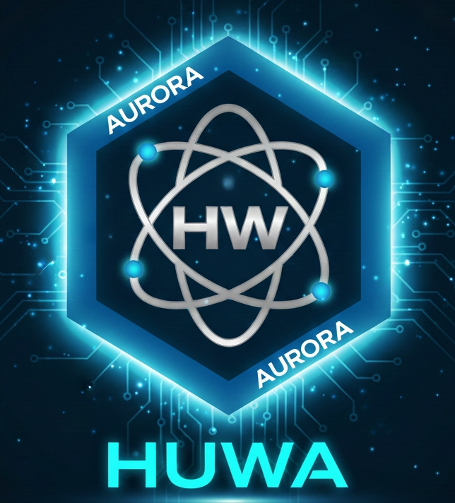

  

# 🌅 Proyecto Aurora
### *"Un ecosistema de aprendizaje y estabilidad financiera diseñado para comunidades en desarrollo"*

---

## ✨ La Esencia de Aurora: 

Aurora es, en su origen, el primer suspiro de luz que vence a la oscuridad. Es ese instante sagrado en el que el cielo se tiñe de colores para anunciar que la vida comienza de nuevo. 

Es el pulso que **anima a los pájaros a cantar** y la caricia que **despierta a cada flor**, preparando el camino para el Sol que iluminará nuestros días.

**Esa misma fuerza vive en la Mujer.** 

Al igual que la aurora natural, la mujer es quien levanta el día en cada hogar. Ella es proactiva, luchadora y no se rinde; capaz de criar, trabajar y sostener un mundo entero con frescura y esperanza. 

La mujer Aurora es proactiva, luchadora y resiliente; es quien levanta el día en cada hogar, nutriendo sueños y preparando el camino para las nuevas generaciones. Este proyecto nace para honrar esa grandeza, convirtiendo el aprendizaje en la semilla de una nueva economía.
La mujer Aurora es proactiva, luchadora y no se rinde; es capaz de criar, trabajar y sostener un hogar, y aun así, levantar la cara para comerse el mundo entero. Ella se pinta sus sueños de colores y frescura, demostrando que su grandeza no tiene límites cuando decide ser el motor de cambio de su comunidad.
En este proyecto, Aurora no es solo tecnología; es ese amanecer humano que ocurre cuando una mujer decide aprender, emprender y brillar.

# 🌟 Proyecto Aurora
> **"Un ecosistema de aprendizaje y estabilidad financiera diseñado para comunidades en desarrollo."**

Proyecto Aurora es una iniciativa de tecnología financiera (FinTech) centrada en la **Minería Educativa**. Nuestro objetivo es integrar el aprendizaje con la generación de activos digitales, permitiendo que el progreso académico sea el motor de una nueva economía local.

---

## 💎 El Núcleo Económico: Huwa (HW)

**Huwa** es la unidad de intercambio del ecosistema, diseñada bajo estándares de estabilidad para proteger el esfuerzo de los usuarios. [cite: 2025-12-28]

* **Base de Comercialización:** Huwa no es solo una recompensa; es una moneda diseñada para el intercambio comercial de bienes y servicios dentro de la comunidad, facilitando transacciones rápidas y seguras. [cite: 2025-12-26]
* **Emisión por Mérito:** El acceso a Huwa se logra a través de la resolución de talleres y tareas de aprendizaje verificables. [cite: 2025-12-26]
* **Resguardo Multicapa:** Protocolos de seguridad avanzados y límites de transacción diseñados para proteger el patrimonio familiar. [cite: 2025-12-30]

## 🚀 Pilares del Proyecto

1.  **Educación Productiva:** Talleres prácticos en habilidades técnicas y oficios. [cite: 2025-12-26]
2.  **Inclusión Financiera Real:** Una herramienta de comercialización que permite a los usuarios comprar y vender con facilidad, sin la volatilidad de otras monedas. [cite: 2025-12-26]
3.  **Transparencia:** Gestión mediante contratos inteligentes en redes blockchain de confianza. [cite: 2025-12-28]

---
*Este proyecto es de código abierto y busca la colaboración de desarrolladores y educadores comprometidos con el desarrollo social.*
